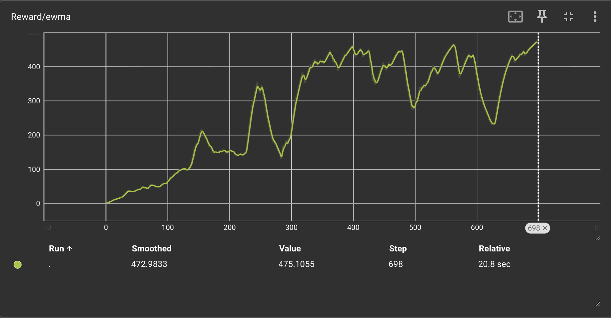
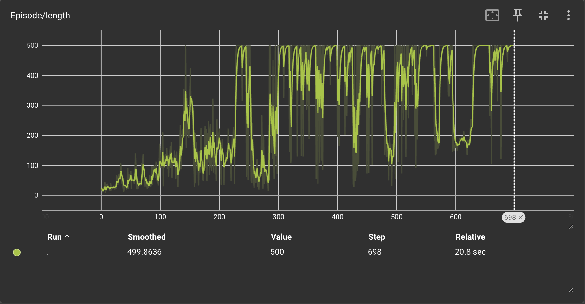
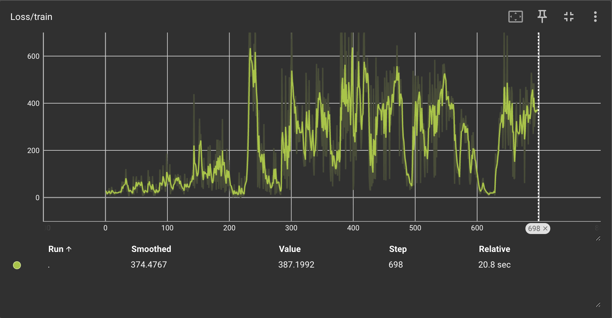
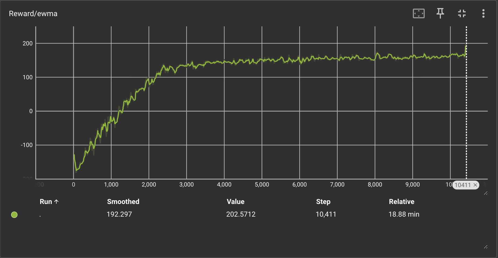
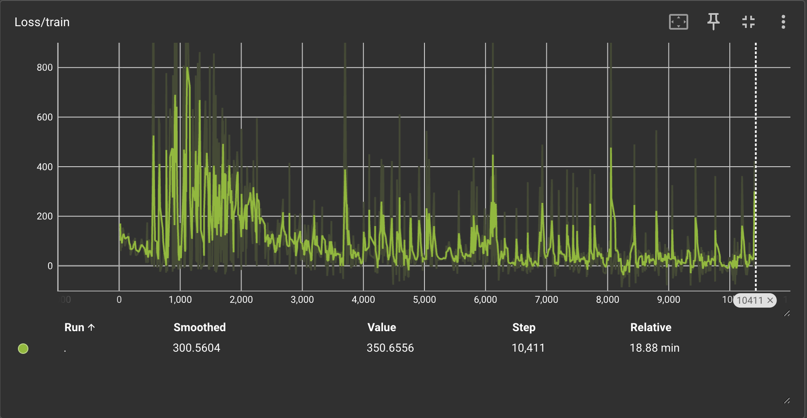
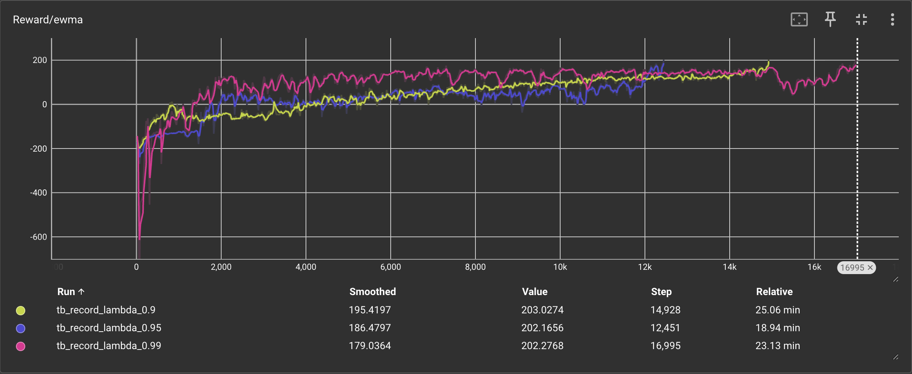
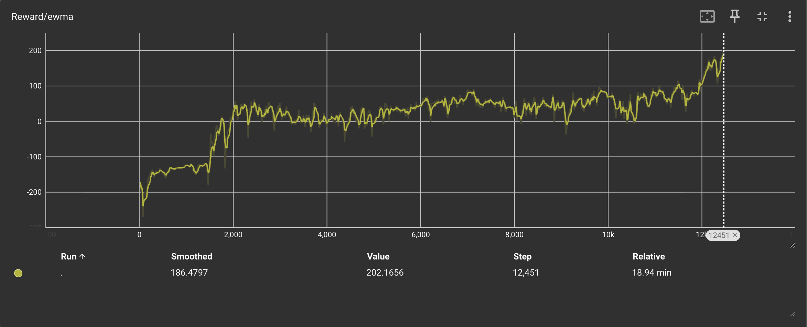

# Homework 1: Fundamentals of MDPs and Policy Gradient

**Course:** 535510 Spring 2026 Reinforcement Learning
**Due:** 2026/04/02 (Thursday) 21:00

---

# Problem 1 — Regularized MDPs (20 pts)

## 1(a) Contraction of the Regularized Bellman Expectation Operator (10 pts)

The regularized Bellman expectation operator is defined as

$$
[T^\pi_\Omega V](s)
= R^\pi(s) + \Omega(\pi(\cdot|s)) + \gamma \sum_{s'} P^\pi(s'|s)\, V(s').
$$

**Proof that $T^\pi_\Omega$ is a contraction in $\ell_\infty$.** Take any two value functions $V$ and $W$. Then

$$
\begin{aligned}
[T^\pi_\Omega V](s) - [T^\pi_\Omega W](s)
&= \gamma \sum_{s'} P^\pi(s'|s)\bigl(V(s')-W(s')\bigr).
\end{aligned}
$$

The regularizer $\Omega(\pi(\cdot|s))$ cancels because it does not depend on $V$. Applying the triangle inequality:

$$
\begin{aligned}
\bigl|[T^\pi_\Omega V](s)-[T^\pi_\Omega W](s)\bigr|
&\le \gamma \sum_{s'} P^\pi(s'|s)\,|V(s')-W(s')| \\
&\le \gamma \|V-W\|_\infty \sum_{s'} P^\pi(s'|s) \\
&= \gamma \|V-W\|_\infty.
\end{aligned}
$$

Taking the supremum over all $s$:

$$
\|T^\pi_\Omega V - T^\pi_\Omega W\|_\infty \le \gamma \|V-W\|_\infty.
$$

Since $0 \le \gamma < 1$, $T^\pi_\Omega$ is a contraction mapping in $\ell_\infty$. $\blacksquare$

---

## 1(b) Value Iteration for the Entropy-Regularized Optimal MDP (10 pts)

With Shannon entropy regularization $\Omega(\pi(\cdot|s)) = H(\pi(\cdot|s)) = -\sum_a \pi(a|s)\ln\pi(a|s)$, the Bellman optimality equations are

$$
Q^*_\Omega(s,a) = R(s,a) + \gamma \sum_{s'} P(s'|s,a)\, V^*_\Omega(s'),
$$
$$
V^*_\Omega(s) = \max_{\pi(\cdot|s)}
\Bigl\{\sum_a \pi(a|s)\,Q^*_\Omega(s,a) + H(\pi(\cdot|s))\Bigr\}.
$$

**Closed-form optimal policy and value.** Introduce a Lagrange multiplier for $\sum_a \pi(a|s)=1$ and differentiate:

$$
Q^*_\Omega(s,a) - \ln\pi^*_\Omega(a|s) - 1 + \lambda = 0
\quad\Rightarrow\quad
\pi^*_\Omega(a|s) \propto \exp\!\bigl(Q^*_\Omega(s,a)\bigr).
$$

Substituting back yields the **log-sum-exp** closed form:

$$
V^*_\Omega(s) = \ln\sum_a \exp\!\bigl(Q^*_\Omega(s,a)\bigr),
\qquad
\pi^*_\Omega(a|s) = \frac{\exp(Q^*_\Omega(s,a))}{\displaystyle\sum_b \exp(Q^*_\Omega(s,b))}.
$$

### Pseudocode

```
Input: S, A, R, P, γ, ε
Initialize V(s) = 0 for all s ∈ S

repeat
    for each s ∈ S do
        for each a ∈ A do
            Q_new(s,a) ← R(s,a) + γ Σ_{s'} P(s'|s,a) V(s')   // one-step lookahead
        end for
        V_new(s) ← ln Σ_a exp(Q_new(s,a))                      // log-sum-exp (soft Bellman)
        π_new(a|s) ← exp(Q_new(s,a) − V_new(s))               // softmax policy
    end for
    δ ← max_s |V_new(s) − V(s)|
    V ← V_new
until δ < ε

// Final Q* and π* from converged V
for each s ∈ S do
    for each a ∈ A do
        Q_star(s,a) ← R(s,a) + γ Σ_{s'} P(s'|s,a) V(s')
    end for
    π_star(a|s) ← exp(Q_star(s,a)) / Σ_b exp(Q_star(s,b))
end for

Output: V*_Ω = V,  Q*_Ω = Q_star,  π*_Ω = π_star
```

### Line-by-line explanation

1. **`Initialize V(s)=0`** — start from an arbitrary value function (correctness is guaranteed by the contraction).
2. **`Q_new(s,a) ← ...`** — compute the one-step lookahead value for each state-action pair using the current $V$.
3. **`V_new(s) ← ln Σ exp(Q_new(s,a))`** — closed-form solution of the entropy-regularized Bellman optimality equation; replaces the hard $\max$ of standard VI with a soft $\log$-$\sum$-$\exp$.
4. **`π_new(a|s) ← exp(Q_new − V_new)`** — recovers the greedy regularized policy; equivalent to $\mathrm{softmax}(Q_{\mathrm{new}}(s,\cdot))$.
5. **`δ ← max_s |V_new − V|`** — measures the largest change; since $T^\pi_\Omega$ is a contraction (part (a)), $\delta \to 0$.
6. **`repeat until δ < ε`** — convergence to the unique fixed point $V^*_\Omega$ is guaranteed.
7. **Final loop** — recomputes $Q^*_\Omega$ and $\pi^*_\Omega$ from the converged value function.
8. **`Output`** — returns $V^*_\Omega$, $Q^*_\Omega$, and the optimal softmax policy $\pi^*_\Omega$.

---

# Problem 2 — Policy Gradient (20 pts)

## 2(a) Occupancy-Measure Identity (8 pts)

Let

$$
d^{\pi_\theta}_\mu(s) = (1-\gamma)\sum_{t=0}^\infty \gamma^t \Pr(s_t=s \mid \tau \sim P^{\pi_\theta}_\mu)
$$

be the discounted state visitation distribution. We prove: for any $f: \mathcal S\times\mathcal A\to\mathbb R$,

$$
\mathbb E_{\tau\sim P^{\pi_\theta}_\mu}
\!\left[\sum_{t=0}^\infty \gamma^t f(s_t,a_t)\right]
=
\frac{1}{1-\gamma}\,
\mathbb E_{s\sim d^{\pi_\theta}_\mu}\,\mathbb E_{a\sim\pi_\theta(\cdot|s)}[f(s,a)].
$$

**Proof** (RHS $\to$ LHS):

$$
\begin{aligned}
\frac{1}{1-\gamma}
\mathbb E_{s\sim d^{\pi_\theta}_\mu}\mathbb E_{a\sim\pi_\theta}[f(s,a)]
&= \frac{1}{1-\gamma}
\sum_s d^{\pi_\theta}_\mu(s)\sum_a \pi_\theta(a|s)\,f(s,a) \\
&= \sum_s \sum_{t=0}^\infty \gamma^t \Pr(s_t=s)
\sum_a \pi_\theta(a|s)\,f(s,a) \\
&= \sum_{t=0}^\infty \gamma^t
\sum_{s,a} \Pr(s_t=s)\,\pi_\theta(a|s)\,f(s,a) \\
&= \sum_{t=0}^\infty \gamma^t\,\mathbb E[f(s_t,a_t)]
= \mathbb E_\tau\!\left[\sum_{t=0}^\infty \gamma^t f(s_t,a_t)\right].
\end{aligned}
$$

The interchange of $\sum_s$ and $\sum_t$ is justified by absolute convergence ($\gamma<1$, $f$ bounded). $\blacksquare$

---

## 2(b) Deriving the Policy Gradient Form (4 pts)

Starting from the REINFORCE policy gradient (P2):

$$
\nabla_\theta V^{\pi_\theta}(\mu)
=
\mathbb E_{\tau\sim P^{\pi_\theta}_\mu}
\!\left[
\sum_{t=0}^\infty \gamma^t
\nabla_\theta \log \pi_\theta(a_t|s_t)\, G_t
\right],
$$

where $G_t = \sum_{k=0}^\infty \gamma^k r_{t+k}$. Since $\mathbb E[G_t \mid s_t,a_t] = Q^{\pi_\theta}(s_t,a_t)$ and the score function $\nabla_\theta\log\pi_\theta(a_t|s_t)$ is measurable w.r.t. $(s_t,a_t)$,

$$
\nabla_\theta V^{\pi_\theta}(\mu)
=
\mathbb E_\tau\!
\left[
\sum_{t=0}^\infty \gamma^t
Q^{\pi_\theta}(s_t,a_t)\,\nabla_\theta \log \pi_\theta(a_t|s_t)
\right].
$$

Applying part (a) with $f(s,a) = Q^{\pi_\theta}(s,a)\,\nabla_\theta\log\pi_\theta(a|s)$:

$$
\boxed{
\nabla_\theta V^{\pi_\theta}(\mu)
= \frac{1}{1-\gamma}
\,\mathbb E_{s\sim d^{\pi_\theta}_\mu}
\,\mathbb E_{a\sim\pi_\theta(\cdot|s)}
\!\left[Q^{\pi_\theta}(s,a)\,\nabla_\theta \log \pi_\theta(a|s)\right].
}
$$

This is exactly the PG expression (P3). $\blacksquare$

---

## 2(c) Checking ACKTR and ACER (8 pts)

### ACKTR (NeurIPS 2017), Section 2.1

The paper states the policy gradient as:

$$
\nabla_\theta J(\theta) = \mathbb{E}_\pi\!\left[\sum_{t=0}^\infty \Psi_t \,\nabla_\theta \log \pi_\theta(a_t|s_t)\right],
$$

where $\Psi_t$ is the advantage function $A^\pi(s_t,a_t)$.

**This expression is incorrect.** The discount factor $\gamma^t$ is missing from the sum. The correct expression consistent with the discounted-return objective $J(\theta) = \mathbb E[\sum_{t\ge 0}\gamma^t r_t]$ is:

$$
\nabla_\theta J(\theta) = \mathbb{E}_\pi\!\left[\sum_{t=0}^\infty \gamma^t\,\Psi_t\,\nabla_\theta \log \pi_\theta(a_t|s_t)\right].
$$

Without $\gamma^t$, every time step's contribution is weighted equally, producing a **biased** gradient estimate for $\gamma < 1$.

---

### ACER (ICLR 2017), Section 2, Equation (1)

The paper gives the marginal importance-weighted policy gradient:

$$
g^{\text{marg}} = \mathbb{E}_{x_t \sim \beta,\, a_t \sim \mu}\!\left[\rho_t\,\nabla_\theta \log \pi_\theta(a_t|x_t)\, Q^\pi(x_t, a_t)\right],
$$

where $\beta(x)$ is the **stationary** distribution under behaviour policy $\mu$, and $\rho_t = \pi_\theta(a_t|x_t)/\mu(a_t|x_t)$.

**This expression is also incorrect**, for two independent reasons:

1. **Missing $\gamma^t$** — same issue as ACKTR.
2. **Wrong state distribution** — uses the undiscounted stationary distribution $\beta$ instead of the discounted occupancy measure $d^{\pi_\theta}_\mu$, which weights early states more heavily (proportional to $\gamma^t$) as required by the discounted objective.

The corrected expression, consistent with part (b), is:

$$
g = \frac{1}{1-\gamma}\,\mathbb{E}_{s \sim d^{\pi_\theta}_\mu}\,\mathbb{E}_{a \sim \mu(\cdot|s)}\!\left[\rho(s,a)\, Q^\pi(s, a)\,\nabla_\theta \log \pi_\theta(a|s)\right],
$$

where $\rho(s,a) = \pi_\theta(a|s)/\mu(a|s)$, or equivalently in trajectory form:

$$
g = \mathbb{E}_{\tau \sim \mu}\!\left[\sum_{t=0}^\infty \gamma^t\,\rho_t\, Q^\pi(s_t, a_t)\,\nabla_\theta \log \pi_\theta(a_t|s_t)\right].
$$

### Summary

| Paper | Expression | Verdict | Issue |
|-------|-----------|---------|-------|
| ACKTR Sec. 2.1 | $\mathbb{E}[\sum_t \Psi_t \nabla_\theta \log \pi_\theta]$ | **Incorrect** | Missing $\gamma^t$ |
| ACER Sec. 2 Eq. (1) | $\mathbb{E}_{x_t\sim\beta,a_t\sim\mu}[\rho_t \nabla_\theta\log\pi_\theta\, Q^\pi]$ | **Incorrect** | Missing $\gamma^t$; uses stationary $\beta$ instead of discounted $d^\pi_\mu$ |

---

# Problem 3 — Baseline for Variance Reduction (20 pts)

**Setup.** One non-terminal state $s$, three actions $\{a,b,c\}$:

$$
r(s,a)=100,\quad r(s,b)=99,\quad r(s,c)=98.
$$

Softmax policy with $\theta_a=0,\,\theta_b=\ln 3,\,\theta_c=\ln 2$:

$$
\pi(a|s)=\tfrac{1}{6},\qquad \pi(b|s)=\tfrac{1}{2},\qquad \pi(c|s)=\tfrac{1}{3}.
$$

Each trajectory is a single step; the estimator is $\hat g = r(s,a_0)\,\nabla_\theta\log\pi(a_0|s)$.
For softmax, $\nabla_\theta\log\pi(a_i|s) = e_i - p$ where $p=(\tfrac{1}{6},\tfrac{1}{2},\tfrac{1}{3})^\top$.

---

## 3(a) Mean and Covariance of $\hat g$ (7 pts)

**Sample gradients:**

$$
\hat g_a = 100\begin{pmatrix}5/6\\-1/2\\-1/3\end{pmatrix}
=\begin{pmatrix}250/3\\-50\\-100/3\end{pmatrix},\quad
\hat g_b = 99\begin{pmatrix}-1/6\\1/2\\-1/3\end{pmatrix}
=\begin{pmatrix}-33/2\\99/2\\-33\end{pmatrix},\quad
\hat g_c = 98\begin{pmatrix}-1/6\\-1/2\\2/3\end{pmatrix}
=\begin{pmatrix}-49/3\\-49\\196/3\end{pmatrix}.
$$

**Value function:**
$V^{\pi_\theta}(s) = \tfrac{1}{6}\cdot100+\tfrac{1}{2}\cdot99+\tfrac{1}{3}\cdot98 = \tfrac{593}{6}.$

**Expected gradient** (using $\mathbb E[\hat g]_j = \pi(j|s)\,(r(s,j)-V)$):

$$
\mathbb E[\hat g]
=\begin{pmatrix}7/36\\1/12\\-5/18\end{pmatrix}.
$$

**Covariance matrix** ($\mathrm{Cov}(\hat g)=\mathbb E[\hat g\hat g^\top]-\mathbb E[\hat g]\mathbb E[\hat g]^\top$):

$$
\operatorname{Cov}(\hat g)=
\begin{pmatrix}
\dfrac{1791617}{1296} & -\dfrac{361177}{432} & -\dfrac{354043}{648} \\[6pt]
-\dfrac{361177}{432} & \dfrac{351665}{144} & -\dfrac{346909}{216} \\[6pt]
-\dfrac{354043}{648} & -\dfrac{346909}{216} & \dfrac{697385}{324}
\end{pmatrix}.
$$

---

## 3(b) Value Function as Baseline (7 pts)

Take baseline $B(s) = V^{\pi_\theta}(s) = \tfrac{593}{6}$. The new estimator is

$$
\tilde g = \bigl(r(s,a_0)-V^{\pi_\theta}(s)\bigr)\,\nabla_\theta\log\pi(a_0|s).
$$

Centered rewards: $100-\tfrac{593}{6}=\tfrac{7}{6}$, $\quad 99-\tfrac{593}{6}=\tfrac{1}{6}$, $\quad 98-\tfrac{593}{6}=-\tfrac{5}{6}$.

**Mean** (unchanged by baseline): $\mathbb E[\tilde g] = \bigl(\tfrac{7}{36},\tfrac{1}{12},-\tfrac{5}{18}\bigr)^\top.$

**Covariance:**

$$
\operatorname{Cov}(\tilde g)=
\begin{pmatrix}
\dfrac{41}{324} & -\dfrac{5}{54} & -\dfrac{11}{324} \\[6pt]
-\dfrac{5}{54} & \dfrac{1}{9} & -\dfrac{1}{54} \\[6pt]
-\dfrac{11}{324} & -\dfrac{1}{54} & \dfrac{17}{324}
\end{pmatrix}.
$$

The diagonal entries drop from $O(10^3)$ to $O(10^{-1})$ — a reduction of roughly $\mathbf{4}$ orders of magnitude — demonstrating the variance-reduction effect of subtracting $V^\pi(s)$.

---

## 3(c) Optimal Baseline (6 pts)

For a scalar state-dependent baseline $B(s)$, minimizing $\operatorname{tr}(\operatorname{Cov}(\nabla V_B))$ amounts to minimizing $\mathbb E[(r-B)^2\|\nabla_\theta\log\pi(a|s)\|^2]$. Setting the derivative to zero:

$$
B^*(s)
=\frac{\mathbb E\bigl[r(s,a)\,\|\nabla_\theta\log\pi(a|s)\|^2\bigr]}
      {\mathbb E\bigl[\|\nabla_\theta\log\pi(a|s)\|^2\bigr]}.
$$

**Score-function squared norms:**

$$
\|\nabla\log\pi(a|s)\|^2=\tfrac{19}{18},\qquad
\|\nabla\log\pi(b|s)\|^2=\tfrac{7}{18},\qquad
\|\nabla\log\pi(c|s)\|^2=\tfrac{13}{18}.
$$

**Numerator:**

$$
\tfrac{1}{6}\cdot100\cdot\tfrac{19}{18}
+\tfrac{1}{2}\cdot99\cdot\tfrac{7}{18}
+\tfrac{1}{3}\cdot98\cdot\tfrac{13}{18}
= \frac{6527}{108}.
$$

**Denominator:**

$$
\tfrac{1}{6}\cdot\tfrac{19}{18}
+\tfrac{1}{2}\cdot\tfrac{7}{18}
+\tfrac{1}{3}\cdot\tfrac{13}{18}
= \frac{66}{108}.
$$

$$
\boxed{B^*(s)=\frac{6527}{66}\approx 98.8939.}
$$

This is slightly larger than $V^{\pi_\theta}(s)=\tfrac{593}{6}\approx 98.8333$ because the trace-minimizing baseline weights each action by the squared norm of its policy score function (giving more weight to actions with larger gradients).

---

# Problem 4 — Policy Gradient with Function Approximation (45 pts)

## 4(a) Vanilla REINFORCE on CartPole-v1 (15 pts)

### Network Architecture

An Actor-Critic network where actor and value heads share the first layer:

| Layer | Details |
|-------|---------|
| Shared | `Linear(4 → 128)` + ReLU |
| Action head | `Linear(128 → 2)` + Softmax |
| Value head | `Linear(128 → 1)` |

All weights initialized with **Xavier uniform**; network uses `float64` (`.double()`).

### Algorithm

1. Roll out a full episode (up to 9 999 steps).
2. Compute discounted rewards-to-go $G_t = \sum_{k=0}^{\infty}\gamma^k r_{t+k}$ backwards.
3. Normalize returns: $\hat G_t = (G_t - \mu_G)/(\sigma_G + \varepsilon)$.
4. Policy loss: $\mathcal L_\pi = -\sum_t \log\pi_\theta(a_t|s_t)\,\hat G_t$.
5. Value loss: $\mathcal L_V = \sum_t \mathrm{MSE}(V(s_t),\,G_t)$.
6. Total loss $\mathcal L = \mathcal L_\pi + \mathcal L_V$; update with Adam.

### Hyperparameters

| Parameter | Value |
|-----------|-------|
| Environment | `CartPole-v1` |
| Learning rate | 0.01 |
| Optimizer | Adam |
| $\gamma$ | 0.999 |
| EWMA $\alpha$ | 0.05 |
| Random seed | 10 |
| Max steps / episode | 9 999 |

### Results

Solved in **698 episodes** (EWMA reward 475.1, threshold 475.0).
Testing (10 episodes): **500 / 500** — perfect score every episode.

### TensorBoard Records

**EWMA Reward** (converges to ≥ 475 by episode 698):



**Episode Length** (stabilizes at maximum 500 steps):



**Training Loss**:



---

## 4(b) REINFORCE with Baseline on LunarLander-v3 (15 pts)

### Baseline Design

The **value function $V^{\pi_\theta}(s)$** (output of the shared value head) is used as the state-dependent baseline. The advantage estimate at each step is:

$$A_t = G_t - V(s_t).$$

The value is **detached** (`.item()`) from the computation graph when constructing the policy gradient, so gradients for the value network flow only through the separate MSE loss. This ensures the two losses do not interfere during backpropagation.

**Why this works:** Subtracting $V(s_t)$ leaves $\mathbb E[\tilde g] = \mathbb E[\hat g]$ (unbiased), but because $V(s_t)$ is a good predictor of $G_t$ the advantage $A_t$ has much smaller magnitude than the raw return, significantly reducing variance (as shown analytically in Problem 3).

### Network Architecture

Same shared structure adapted for LunarLander-v3:

| Layer | Details |
|-------|---------|
| Shared | `Linear(8 → 128)` + ReLU |
| Action head | `Linear(128 → 4)` + Softmax |
| Value head | `Linear(128 → 1)` |

### Hyperparameters

| Parameter | Value |
|-----------|-------|
| Environment | `LunarLander-v3` |
| Learning rate | 0.002 |
| Optimizer | Adam |
| $\gamma$ | 0.99 |
| EWMA $\alpha$ | 0.05 |
| Random seed | 10 |

### Results

Solved in **10 411 episodes** (EWMA reward 202.6, threshold 200).
Testing (10 episodes): average reward **~258–311**.

### TensorBoard Records

**EWMA Reward** (rises from negative territory to above 200):



**Training Loss**:



---

## 4(c) REINFORCE with GAE on LunarLander-v3 (15 pts)

### GAE Implementation

Generalized Advantage Estimation (Schulman et al., 2016) computes advantages by a **backwards recursive pass**:

$$
\delta_t = r_t + \gamma\,V(s_{t+1})(1-\mathrm{done}_t) - V(s_t),
$$
$$
A_t^{\mathrm{GAE}} = \sum_{l=0}^{\infty}(\gamma\lambda)^l\,\delta_{t+l}
= \delta_t + \gamma\lambda(1-\mathrm{done}_t)\,A_{t+1}^{\mathrm{GAE}}.
$$

**Key implementation details:**

- **Bootstrap value:** if episode ends by **truncation** (timeout), $V(s_T)$ from the network is used as the bootstrap value; if **terminated** (crash or landing), bootstrap $= 0$. The `values` list is length $T+1$, making `values[t+1]` always valid.
- `num_steps = None` → full-episode (full-batch) mode.
- GAE advantages are **normalized** before computing the policy loss.
- The value network is supervised by **discounted returns** $G_t$ (not by GAE advantages) via MSE loss.

**Bias–variance tradeoff:**

| $\lambda$ | Behavior |
|-----------|----------|
| $\lambda \to 0$ | High bias, low variance (approaches TD(0)) |
| $\lambda \to 1$ | Low bias, high variance (approaches Monte Carlo) |
| $\lambda = 0.95$ | Balanced; empirically fastest convergence |

### Hyperparameters

| Parameter | Value |
|-----------|-------|
| Environment | `LunarLander-v3` |
| Learning rate | 0.005 |
| Optimizer | Adam |
| $\gamma$ | 0.99 |
| $\lambda$ | 0.90 / 0.95 / 0.99 |
| EWMA $\alpha$ | 0.05 |
| Random seed | 10 |

### Results

| $\lambda$ | Episodes to Solve | Final EWMA Reward |
|-----------|:-----------------:|:-----------------:|
| 0.90 | 14 928 | 203.0 |
| **0.95** | **12 451** | **202.2** |
| 0.99 | 16 995 | 202.3 |

$\lambda=0.95$ converges fastest. $\lambda=0.90$ (higher bias) and $\lambda=0.99$ (higher variance) both require more episodes, consistent with the theoretical bias–variance tradeoff.

### TensorBoard Records

**EWMA Reward — all three $\lambda$ values overlaid** (pink = 0.95 reaches threshold first):



**Individual run — $\lambda = 0.95$:**



---

## Problem 4 Summary

| Sub-problem | Environment | Algorithm | Episodes to Solve | Test Reward |
|-------------|-------------|-----------|:-----------------:|:-----------:|
| (a) | CartPole-v1 | Vanilla REINFORCE | 698 | 500 / 500 |
| (b) | LunarLander-v3 | REINFORCE + Value Baseline | 10 411 | ~258–311 |
| (c) $\lambda$=0.90 | LunarLander-v3 | REINFORCE + GAE | 14 928 | >200 |
| (c) $\lambda$=0.95 | LunarLander-v3 | REINFORCE + GAE | 12 451 | >200 |
| (c) $\lambda$=0.99 | LunarLander-v3 | REINFORCE + GAE | 16 995 | >200 |
