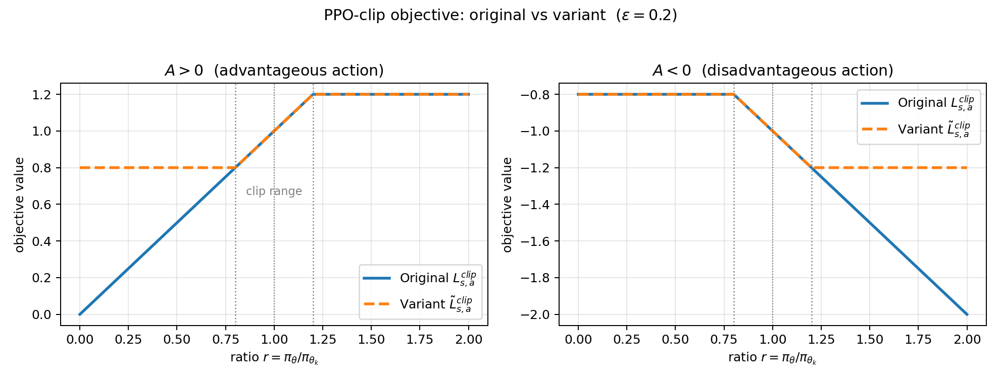
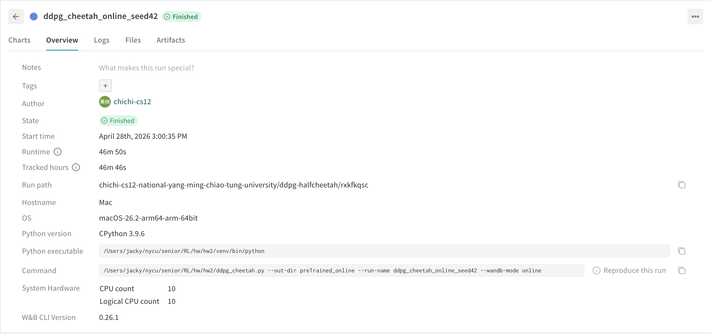
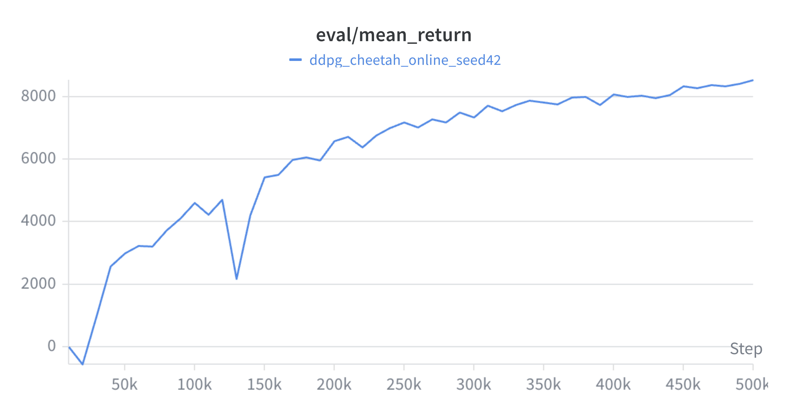
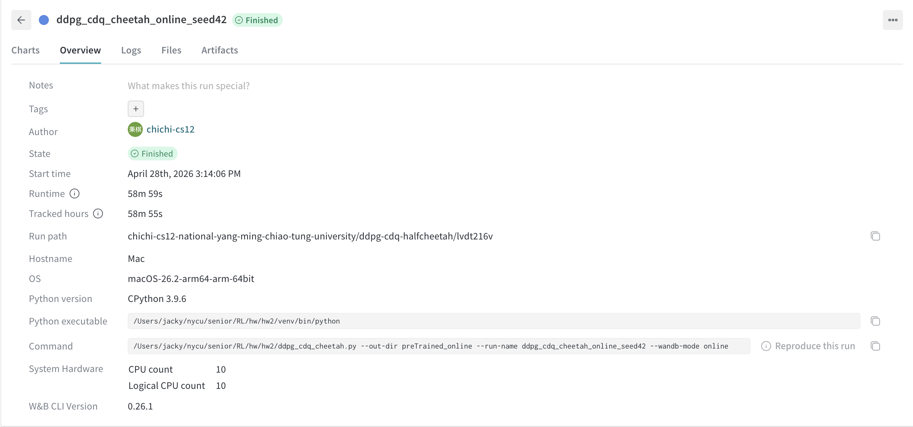
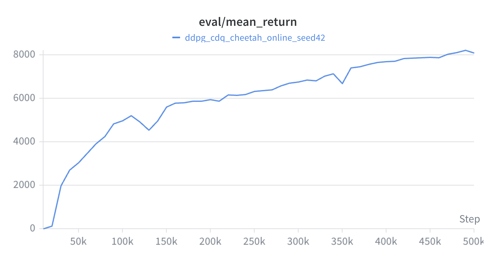

# Homework 2 Answer

## Problem 1

Let

$$r(\theta)=\frac{\pi_\theta(a|s)}{\pi_{\theta_k}(a|s)}, \qquad A=A^{\pi_{\theta_k}}(s,a).$$

The two objectives are

$$L^{clip}_{s,a}(\theta;\theta_k)=\min(rA,\operatorname{clip}(r,1-\epsilon,1+\epsilon)A),$$

and

$$\tilde L^{clip}_{s,a}(\theta;\theta_k)=\operatorname{clip}(r,1-\epsilon,1+\epsilon)A.$$

Their behavior differs because the original PPO objective uses the minimum to make the clipping pessimistic. The variant always uses the clipped ratio, even when doing so gives an optimistic value.

| Advantage sign | Ratio region | Original PPO objective | Variant objective | Behavioral effect |
|---|---:|---:|---:|---|
| $A>0$ | $r<1-\epsilon$ | $rA$ | $(1-\epsilon)A$ | Original still rewards increasing $r$ toward the old policy ratio; variant is flat and gives no gradient. |
| $A>0$ | $1-\epsilon \le r \le 1+\epsilon$ | $rA$ | $rA$ | Same objective and same gradient. |
| $A>0$ | $r>1+\epsilon$ | $(1+\epsilon)A$ | $(1+\epsilon)A$ | Both are flat; increasing probability of a good action beyond the trust region is not rewarded. |
| $A<0$ | $r<1-\epsilon$ | $(1-\epsilon)A$ | $(1-\epsilon)A$ | Both are flat; decreasing probability of a bad action too much is not further rewarded. |
| $A<0$ | $1-\epsilon \le r \le 1+\epsilon$ | $rA$ | $rA$ | Same objective and same gradient. |
| $A<0$ | $r>1+\epsilon$ | $rA$ | $(1+\epsilon)A$ | Original keeps penalizing increases in probability of a bad action; variant is flat and stops correcting it. |

Therefore, the original objective clips only the policy changes that would improve the surrogate too much: too large $r$ for positive advantage and too small $r$ for negative advantage. If a change moves in the harmful direction, the original objective remains linear and keeps a gradient that pushes the policy back. The variant clips both directions symmetrically and can remove useful corrective gradients. This makes $\tilde L^{clip}$ less conservative in the PPO sense, because it can assign the clipped value even when the unclipped value is worse.

Piecewise, the original PPO objective is

$$
L^{clip}_{s,a} =
\begin{cases}
rA, & A>0,\ r \le 1+\epsilon,\\
(1+\epsilon)A, & A>0,\ r>1+\epsilon,\\
(1-\epsilon)A, & A<0,\ r<1-\epsilon,\\
rA, & A<0,\ r \ge 1-\epsilon.
\end{cases}
$$

The variant is

$$
\tilde L^{clip}_{s,a} =
\begin{cases}
(1-\epsilon)A, & r<1-\epsilon,\\
rA, & 1-\epsilon \le r \le 1+\epsilon,\\
(1+\epsilon)A, & r>1+\epsilon.
\end{cases}
$$

The important plot-level difference is that, for $A>0$, original PPO is linear on the left and flat on the right, while the variant is flat on both sides. For $A<0$, original PPO is flat on the left and linear on the right, while the variant is again flat on both sides.



**Figure 1:** PPO-clip objective vs the variant ($\varepsilon=0.2$). Left ($A>0$): the original is linear for $r<1-\varepsilon$ and flat for $r>1+\varepsilon$, while the variant is flat on **both** sides — it loses the corrective gradient that pushes $r$ back into the trust region when the new policy under-shoots. Right ($A<0$): the original is flat for $r<1-\varepsilon$ and linear for $r>1+\varepsilon$, keeping a strong gradient that penalises increasing the probability of a bad action; the variant is again flat on both sides and stops correcting in this regime.

## Problem 2

### (a)

For the visited state $s_t$, TD(0) updates

$$V_{t+1}(s_t)=V_t(s_t)+\alpha_t(s_t)(r_t+\gamma V_t(s_{t+1})-V_t(s_t)).$$

For any state $s\ne s_t$, the estimate is unchanged:

$$V_{t+1}(s)=V_t(s).$$

Equivalently, for $s\ne s_t$ we may write

$$V_{t+1}(s)=V_t(s)+\alpha_t(s)(r_t+\gamma V_t(s_{t+1})-V_t(s))$$

with

$$\alpha_t(s)=0.$$

### (b)

Define the error process

$$W_t(s)=V_t(s)-V^\pi(s).$$

For $s=s_t$,

$$W_{t+1}(s_t)=W_t(s_t)+\alpha_t(s_t)(r_t+\gamma V_t(s_{t+1})-V_t(s_t)).$$

To match Theorem 1,

$$W_{t+1}(s_t)=(1-\alpha_t(s_t))W_t(s_t)+\alpha_t(s_t)\varepsilon_t(s_t),$$

where

$$\varepsilon_t(s_t)=r_t+\gamma V_t(s_{t+1})-V^\pi(s_t).$$

For $s\ne s_t$, $\alpha_t(s)=0$, $W_t(s)=V_t(s)-V^\pi(s)$, and $\varepsilon_t(s)$ can be chosen arbitrarily because it is multiplied by zero. A convenient choice is

$$\varepsilon_t(s)=0.$$

### (c)

For the visited state $s_t=s$, condition on the history $\mathcal H_t$. Since $V^\pi$ satisfies the Bellman equation,

$$V^\pi(s)=\mathbb E[r_t+\gamma V^\pi(s_{t+1})\mid s_t=s,\mathcal H_t].$$

Thus

$$
\begin{aligned}
\mathbb E[\varepsilon_t(s)\mid\mathcal H_t]
&=\mathbb E[r_t+\gamma V_t(s_{t+1})-V^\pi(s)\mid\mathcal H_t]\\
&=\gamma\mathbb E[V_t(s_{t+1})-V^\pi(s_{t+1})\mid\mathcal H_t]\\
&=\gamma\mathbb E[W_t(s_{t+1})\mid\mathcal H_t].
\end{aligned}
$$

Therefore,

$$\left|\mathbb E[\varepsilon_t(s)\mid\mathcal H_t]\right|
\le \gamma \|W_t\|_\infty.$$

Because $\gamma\in(0,1)$, condition (C2) holds with $\rho=\gamma$.

For (C3), assume the finite MDP has bounded rewards, so $|r_t|\le R_{\max}$. Then

$$
|\varepsilon_t(s)|
=|r_t+\gamma V_t(s_{t+1})-V^\pi(s)|.
$$

Using $V_t=V^\pi+W_t$,

$$
|\varepsilon_t(s)|
\le R_{\max}+\gamma \|V^\pi\|_\infty+\gamma\|W_t\|_\infty+\|V^\pi\|_\infty.
$$

Since $\|V^\pi\|_\infty\le R_{\max}/(1-\gamma)$, there is a finite constant $K$ such that

$$|\varepsilon_t(s)|\le K(1+\|W_t\|_\infty).$$

Hence

$$\mathbb V[\varepsilon_t(s)\mid\mathcal H_t]\le
\mathbb E[\varepsilon_t(s)^2\mid\mathcal H_t]\le K^2(1+\|W_t\|_\infty)^2,$$

so (C3) holds with $C=K^2$. For $s\ne s_t$, $\alpha_t(s)=0$, so those coordinates are not updated at time $t$ and the same bound is harmless.

### (d)

By (a) and (b), the TD(0) error process can be written in the stochastic approximation form

$$W_{t+1}(s)=(1-\alpha_t(s))W_t(s)+\alpha_t(s)\varepsilon_t(s).$$

Part (c) shows that (C2) and (C3) hold. If (C1) also holds, then Theorem 1 implies

$$W_t(s)\to 0 \qquad \text{for every } s\in S \text{ almost surely.}$$

Since $W_t(s)=V_t(s)-V^\pi(s)$, this gives

$$V_t(s)\to V^\pi(s) \qquad \text{for every } s\in S \text{ almost surely.}$$

## Problem 3

Let

$$g=\nabla_\theta L_{\theta_k}(\theta)\big|_{\theta=\theta_k}, \qquad x=\theta-\theta_k.$$

The primal problem is

$$\min_x -g^\top x \quad \text{s.t.}\quad \frac12 x^\top Hx-\delta\le 0.$$

The Lagrangian is

$$L(x,\lambda)=-g^\top x+\lambda\left(\frac12x^\top Hx-\delta\right).$$

### (a)

For $\lambda>0$, minimize the Lagrangian over $x$. The first-order condition is

$$\nabla_x L(x,\lambda)=-g+\lambda Hx=0,$$

so

$$x(\lambda)=\frac1\lambda H^{-1}g.$$

Substituting this into the Lagrangian,

$$
\begin{aligned}
D(\lambda)
&=-g^\top\left(\frac1\lambda H^{-1}g\right)
+\lambda\left(\frac12\left(\frac1\lambda H^{-1}g\right)^\top H
\left(\frac1\lambda H^{-1}g\right)-\delta\right)\\
&=-\frac1\lambda g^\top H^{-1}g+\frac1{2\lambda}g^\top H^{-1}g-\lambda\delta\\
&=-\frac1{2\lambda}g^\top H^{-1}g-\lambda\delta.
\end{aligned}
$$

This is Equation (11). To maximize over $\lambda>0$, differentiate:

$$D'(\lambda)=\frac{1}{2\lambda^2}g^\top H^{-1}g-\delta.$$

Setting $D'(\lambda)=0$ gives

$$\lambda^*=\sqrt{\frac{g^\top H^{-1}g}{2\delta}}.$$

### (b)

By strong duality, the primal optimizer minimizes $L(x,\lambda^*)$, so

$$x^*=\frac1{\lambda^*}H^{-1}g.$$

Therefore,

$$\theta^*=\theta_k+\alpha H^{-1}_{\theta_k}\nabla_\theta L_{\theta_k}(\theta)\big|_{\theta=\theta_k},$$

where

$$\alpha=\frac1{\lambda^*}=\sqrt{\frac{2\delta}{g^\top H^{-1}g}}.$$

## Problem 4

### DDPG implementation for `Pendulum-v1`

The completed `ddpg.py` implements the following DDPG components.

| Component | Implementation |
|---|---|
| Actor | Two hidden ReLU layers followed by `tanh`; the output is scaled to the environment action bounds. |
| Critic | Concatenates state and action, then uses two hidden ReLU layers and outputs one scalar Q-value. |
| Exploration | Ornstein-Uhlenbeck noise is added to actor actions during training and clipped to action bounds. |
| Critic target | $y=r+\gamma(1-d)Q_{\bar w}(s',\pi_{\bar\theta}(s'))$. |
| Critic loss | Mean squared Bellman error. |
| Actor loss | $-\mathbb E_s[Q_w(s,\pi_\theta(s))]$. |
| Target update | Soft update with coefficient $\tau$. |
| Replay buffer | Uniform random replay buffer sampling. |

The hyperparameters currently used in `ddpg.py` are:

| Hyperparameter | Value |
|---|---:|
| Environment | `Pendulum-v1` |
| Episodes | 300 |
| Discount factor $\gamma$ | 0.99 |
| Target update $\tau$ | 0.005 |
| Hidden size | 256 |
| Actor learning rate | 1e-4 |
| Critic learning rate | 3e-4 |
| Replay buffer size | 1,000,000 |
| Batch size | 128 |
| Warmup steps | 1,000 |
| Updates per environment step | 1 |
| Exploration noise scale | linearly annealed from 0.2 to 0.05 |
| Random seed | 42 |

Local correctness checks:

1. `ddpg.py` compiles successfully under the HW1 virtual environment Python interpreter.
2. A smoke test on `Pendulum-v1` constructs the agent, samples an action, verifies that the action is inside the environment action bounds, and runs one actor/critic update on a synthetic batch with finite losses.

The Pendulum run was first logged offline and then synced to W&B after login.

Run command:

```bash
cd /Users/jacky/nycu/senior/RL/hw/hw2
venv/bin/python ddpg.py
```

Training result from the 300-episode run:

| Metric | Result |
|---|---:|
| Best saved EWMA training score | -141.96 |
| W&B run final 20-episode evaluation score | -172.66 |
| Re-evaluated final checkpoint over 20 episodes | -109.91 |
| Saved actor checkpoint | `preTrained/ddpg_actor_Pendulum-v1_ep299_score-142.0.pth` |
| Saved critic checkpoint | `preTrained/ddpg_critic_Pendulum-v1_ep299_score-142.0.pth` |
| W&B synced run | https://wandb.ai/chichi-cs12-national-yang-ming-chiao-tung-university/ddpg/runs/wroa9y90 |

Because `Pendulum-v1` starts from randomized initial states, the 20-episode evaluation score has noticeable variance. The final checkpoint was re-evaluated and obtained an average score of -109.91 over 20 episodes, which is better than the suggested target of approximately -130.

### DDPG implementation for `HalfCheetah-v5`

The file `ddpg_cheetah.py` adapts the DDPG implementation to the MuJoCo `HalfCheetah-v5` task. It uses the same actor-critic structure, a replay buffer, target networks, soft target updates, and deterministic policy gradient updates. Exploration uses Gaussian action noise clipped to the action bounds.

Run command for the required 500k environment steps:

```bash
cd /Users/jacky/nycu/senior/RL/hw/hw2
venv/bin/python ddpg_cheetah.py --max-steps 500000 --eval-episodes 20 --wandb-mode online
```

The online rerun used:

```bash
venv/bin/python ddpg_cheetah.py --out-dir preTrained_online --run-name ddpg_cheetah_online_seed42 --wandb-mode online
```

The script saves best, periodic, and final checkpoints under the selected output directory.

Default hyperparameters:

| Hyperparameter | Value |
|---|---:|
| Environment | `HalfCheetah-v5` |
| Environment steps | 500,000 |
| Discount factor $\gamma$ | 0.99 |
| Target update $\tau$ | 0.005 |
| Hidden size | 256 |
| Actor learning rate | 3e-4 |
| Critic learning rate | 3e-4 |
| Replay buffer size | 1,000,000 |
| Batch size | 256 |
| Random exploration steps | 10,000 |
| Exploration noise std | 0.1 times action bound |
| Evaluation frequency | every 10,000 steps |
| Evaluation episodes | 20 |
| Random seed | 42 |

Training result from the 500k-step run:

| Metric | Result |
|---|---:|
| Best average evaluation score over 20 episodes | 8536.79 |
| Final average evaluation score over 20 episodes | 8536.79 |
| Step where best score occurs | 500,000 |
| Saved actor checkpoint | `preTrained_online/ddpg_actor_HalfCheetah-v5_best_step500000_score8536.8.pth` |
| Saved critic checkpoint | `preTrained_online/ddpg_critic_HalfCheetah-v5_best_step500000_score8536.8.pth` |
| Final actor checkpoint | `preTrained_online/ddpg_actor_HalfCheetah-v5_final.pth` |
| Final critic checkpoint | `preTrained_online/ddpg_critic_HalfCheetah-v5_final.pth` |
| W&B run | https://wandb.ai/chichi-cs12-national-yang-ming-chiao-tung-university/ddpg-halfcheetah/runs/rxkfkqsc |

The vanilla DDPG online run reached the required average evaluation score of 5,000 by 150k steps and stayed above the requirement for the rest of training. The best observed score, 8536.79, is within the expected 6,000-10,000 range stated in the assignment.

W&B snapshots for the vanilla DDPG run:





### DDPG with Clipped Double Q for `HalfCheetah-v5`

The file `ddpg_cdq_cheetah.py` implements the clipped double-Q enhancement. It keeps two critic networks $Q_{w_1}$ and $Q_{w_2}$ and two target critics. For critic targets, the code computes

$$
y = r + \gamma(1-d)\min_{i=1,2}Q_{\bar w_i}(s', \pi_{\bar\theta}(s') + \epsilon),
$$

where the target action noise is clipped and the final target action is clipped to the action bounds. Each critic is trained against the same clipped-double-Q target, and the actor is updated to maximize $Q_{w_1}(s,\pi_\theta(s))$.

Run command for the required 500k environment steps:

```bash
cd /Users/jacky/nycu/senior/RL/hw/hw2
venv/bin/python ddpg_cdq_cheetah.py --max-steps 500000 --eval-episodes 20 --wandb-mode online
```

The online rerun used:

```bash
venv/bin/python ddpg_cdq_cheetah.py --out-dir preTrained_online --run-name ddpg_cdq_cheetah_online_seed42 --wandb-mode online
```

Default hyperparameters:

| Hyperparameter | Value |
|---|---:|
| Environment | `HalfCheetah-v5` |
| Environment steps | 500,000 |
| Discount factor $\gamma$ | 0.99 |
| Target update $\tau$ | 0.005 |
| Hidden size | 256 |
| Actor learning rate | 3e-4 |
| Critic learning rate | 3e-4 |
| Replay buffer size | 1,000,000 |
| Batch size | 256 |
| Random exploration steps | 10,000 |
| Exploration noise std | 0.1 times action bound |
| Target policy noise std | 0.2 times action bound |
| Target policy noise clip | 0.5 times action bound |
| Actor update frequency | every critic update |
| Evaluation frequency | every 10,000 steps |
| Evaluation episodes | 20 |
| Random seed | 42 |

Training result from the 500k-step run:

| Metric | Result |
|---|---:|
| Best CDQ average evaluation score over 20 episodes | 8223.49 |
| Final CDQ average evaluation score over 20 episodes | 8091.27 |
| Step where best score occurs | 490,000 |
| Saved actor checkpoint | `preTrained_online/ddpg_cdq_actor_HalfCheetah-v5_best_step490000_score8223.5.pth` |
| Saved critics checkpoint | `preTrained_online/ddpg_cdq_critics_HalfCheetah-v5_best_step490000_score8223.5.pth` |
| Final actor checkpoint | `preTrained_online/ddpg_cdq_actor_HalfCheetah-v5_final.pth` |
| Final critics checkpoint | `preTrained_online/ddpg_cdq_critics_HalfCheetah-v5_final.pth` |
| W&B run | https://wandb.ai/chichi-cs12-national-yang-ming-chiao-tung-university/ddpg-cdq-halfcheetah/runs/lvdt216v |

Compared with vanilla DDPG, the CDQ run crossed the 5,000 threshold earlier, at 110k steps, while vanilla DDPG crossed it at 150k steps. In this online seed, vanilla DDPG obtained the higher final and peak score, 8536.79, while CDQ peaked at 8223.49 and finished at 8091.27. The CDQ curve improved steadily in the late stage and stayed close to its peak after 470k steps, which is consistent with clipped double Q reducing positive Q-value overestimation through the minimum of two target critics. Both HalfCheetah runs were synced online to W&B using the run links listed above.


**Figure 2:** 20-episode evaluation return on `HalfCheetah-v5` for vanilla DDPG (blue) and DDPG with Clipped Double Q (orange); shaded bands are ±1 std across the 20 evaluation episodes. CDQ crosses the 5,000 target ~40k steps earlier and is markedly more stable: vanilla DDPG suffers a large drawdown around step 130k (a known symptom of optimistic Q-bias) before recovering, while CDQ has only a small wobble at ~120k and a brief dip at ~350k. Vanilla ends slightly higher at 500k.


**Figure 3:** Critic Bellman loss (smoothed, log scale). The two CDQ critics track each other closely throughout, confirming that taking the minimum of two independently trained $Q$-targets is a real ensemble (the critics do disagree in their raw values even though their losses are similar). The vanilla critic converges to a slightly lower steady-state loss than either CDQ critic, but this lower loss does not translate into a more reliable evaluation curve — consistent with the well-known finding that vanilla DDPG's lower TD error can come from fitting an over-estimated bootstrap target.

W&B snapshots for the CDQ run:





### Code correctness checks

The source files were checked with the HW2 virtual environment:

```bash
venv/bin/python -m py_compile ddpg.py ddpg_cheetah.py ddpg_cdq_cheetah.py
```

Smoke tests were also run with short HalfCheetah rollouts to verify that environment interaction, replay buffer sampling, and actor/critic updates execute with finite losses.
