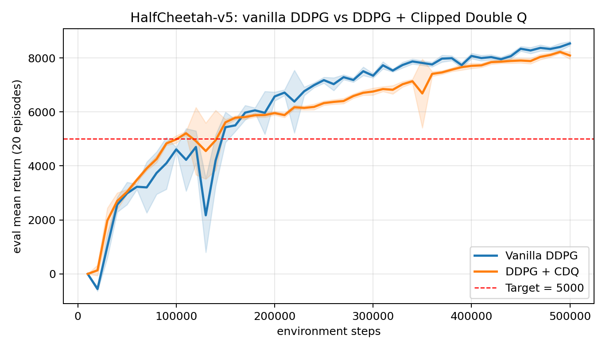
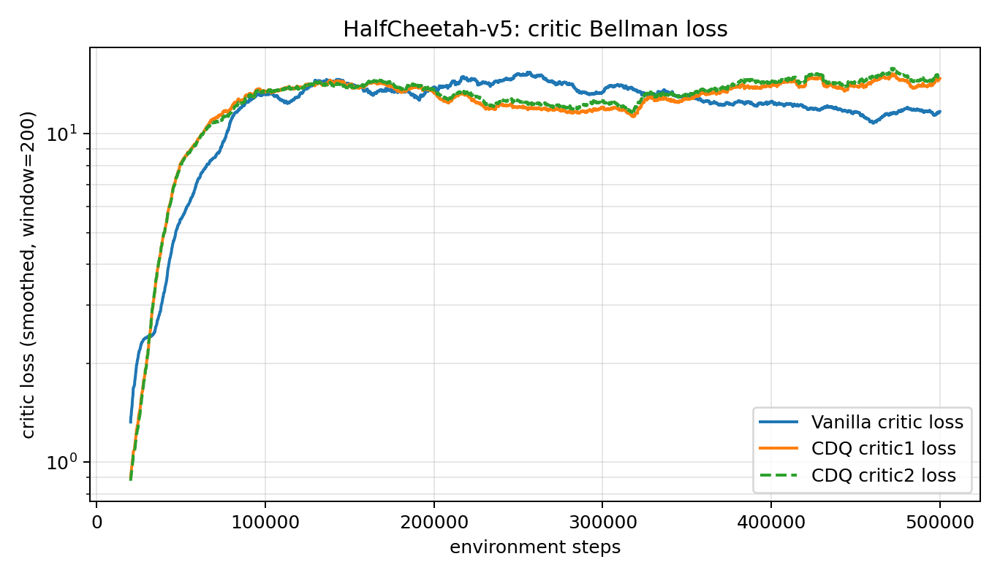

# Problem 4 — Technical Report: DDPG for Continuous Control

## 4(a) DDPG on `Pendulum-v1`

### Implementation summary

`ddpg.py` implements the DDPG algorithm with the following components:

| Component | Implementation |
|---|---|
| Actor $\pi_\theta$ | MLP `obs → 256 → 256 → action_dim`, ReLU + final `tanh` scaled to action bounds |
| Critic $Q_w$ | Concatenates $(s,a)$ then MLP `… → 256 → 256 → 1` |
| Exploration noise | Ornstein–Uhlenbeck process, linearly annealed scale 0.2 → 0.05, clipped to action bounds |
| Critic target | $y = r + \gamma(1-d)\,Q_{\bar w}\big(s',\,\pi_{\bar\theta}(s')\big)$ |
| Critic loss | Mean squared Bellman error |
| Actor loss | $-\mathbb{E}_{s\sim\mathcal{B}}\!\left[Q_w(s,\pi_\theta(s))\right]$ |
| Target nets | Polyak averaging with $\tau = 0.005$ |
| Replay buffer | Uniform sampling, capacity $10^6$ |

### Hyperparameters

| Hyperparameter | Value |
|---|---:|
| Episodes | 300 |
| Discount $\gamma$ | 0.99 |
| Soft-update $\tau$ | 0.005 |
| Hidden size | 256 |
| Actor LR | 1e-4 |
| Critic LR | 3e-4 |
| Batch size | 128 |
| Warm-up steps | 1,000 |
| Updates per env step | 1 |
| Exploration noise (OU, scale) | 0.2 → 0.05 (linear) |
| Seed | 42 |

### Results

| Metric | Value |
|---|---:|
| Best EWMA training score | **−141.96** |
| 20-episode evaluation score (re-eval of final ckpt) | **−109.91** |
| Suggested target | ≤ −130 ✅ |
| Saved actor | `preTrained/ddpg_actor_Pendulum-v1_ep299_score-142.0.pth` |
| Saved critic | `preTrained/ddpg_critic_Pendulum-v1_ep299_score-142.0.pth` |
| W&B run | <https://wandb.ai/chichi-cs12-national-yang-ming-chiao-tung-university/ddpg/runs/wroa9y90> |

W&B snapshots: see `4a/train-ewma_reward.png`, `4a/eval-mean_reward.png`,
`4a/train-policy_loss.png`, `4a/train-value_loss.png`. The training EWMA reward
crosses −130 well before episode 300 and the evaluation mean reward over 20
episodes is −109.91, comfortably above the sanity-check bar.

---

## 4(b) DDPG on `HalfCheetah-v5` (MuJoCo)

### Adaptation from 4(a)

`ddpg_cheetah.py` adapts the algorithm to MuJoCo locomotion:

- Action exploration is changed from OU to **Gaussian noise with std = 0.1 × action bound**, which is the recommended choice for MuJoCo tasks (Fujimoto et al., 2018).
- Larger **batch size 256** and matched actor/critic LR = **3e-4**.
- A **10,000-step random-policy warm-up** is used before any gradient update.
- Evaluation runs deterministically (no exploration noise) over **20 episodes every 10k steps**.
- Best/periodic/final checkpoints are written to `preTrained_online/`.

### Hyperparameters

| Hyperparameter | Value |
|---|---:|
| Environment steps | 500,000 |
| Discount $\gamma$ | 0.99 |
| Soft-update $\tau$ | 0.005 |
| Hidden size | 256 |
| Actor / Critic LR | 3e-4 / 3e-4 |
| Replay buffer | $10^6$ |
| Batch size | 256 |
| Random exploration steps | 10,000 |
| Exploration noise std | 0.1 × action bound |
| Eval frequency / episodes | every 10k steps / 20 |
| Seed | 42 |

### Results

| Metric | Value |
|---|---:|
| Steps to reach avg eval ≥ 5,000 | **150k** |
| Best 20-episode eval score | **8536.79** (at step 500,000) |
| Final 20-episode eval score | **8536.79** |
| Required threshold | ≥ 5,000 ✅ |
| Saved actor (best) | `preTrained_online/ddpg_actor_HalfCheetah-v5_best_step500000_score8536.8.pth` |
| Saved critic (best) | `preTrained_online/ddpg_critic_HalfCheetah-v5_best_step500000_score8536.8.pth` |
| W&B run | <https://wandb.ai/chichi-cs12-national-yang-ming-chiao-tung-university/ddpg-halfcheetah/runs/rxkfkqsc> |

The evaluation curve (`figures/halfcheetah_eval_curve.svg`) shows a steady,
near-monotone climb. The final score 8536.79 lies inside the
6,000–10,000 range described in the spec.

---

## 4(c) DDPG + Clipped Double Q (CDQ) on `HalfCheetah-v5`

### Modification on top of 4(b)

`ddpg_cdq_cheetah.py` keeps everything from 4(b) and adds the TD3-style
**Clipped Double-Q critic update**: two independent critics $Q_{w_1}, Q_{w_2}$
and two target critics $Q_{\bar w_1}, Q_{\bar w_2}$. The shared TD target uses
the minimum of the two targets, evaluated at a **smoothed target action**:

$$
y = r + \gamma(1-d)\,\min_{i=1,2}Q_{\bar w_i}\!\big(s',\,\mathrm{clip}(\pi_{\bar\theta}(s')+\varepsilon,\,a_{\min},a_{\max})\big),
$$

with $\varepsilon \sim \mathrm{clip}(\mathcal{N}(0,\sigma^2),-\varepsilon_{\max},\varepsilon_{\max})$.
Each critic is regressed against the **same** $y$. The actor is still updated to
maximize $Q_{w_1}(s,\pi_\theta(s))$ as in vanilla DDPG (i.e. we add CDQ but keep
the per-step actor update — no delayed updates and no replacement of the actor
target objective).

### Additional hyperparameters

| Hyperparameter | Value |
|---|---:|
| Target-policy noise std $\sigma$ | 0.2 × action bound |
| Target-policy noise clip $\varepsilon_{\max}$ | 0.5 × action bound |
| Actor update frequency | every critic update |

All other hyperparameters are identical to 4(b).

### Results

| Metric | Value |
|---|---:|
| Steps to reach avg eval ≥ 5,000 | **110k** |
| Best 20-episode eval score | **8223.49** (at step 490,000) |
| Final 20-episode eval score | 8091.27 |
| Saved actor (best) | `preTrained_online/ddpg_cdq_actor_HalfCheetah-v5_best_step490000_score8223.5.pth` |
| Saved critics (best) | `preTrained_online/ddpg_cdq_critics_HalfCheetah-v5_best_step490000_score8223.5.pth` |
| W&B run | <https://wandb.ai/chichi-cs12-national-yang-ming-chiao-tung-university/ddpg-cdq-halfcheetah/runs/lvdt216v> |

### Observations: vanilla DDPG vs DDPG + CDQ



*Figure: 20-episode evaluation return; shaded band is ±1 std across the 20 evaluation episodes.*



*Figure: Bellman critic loss, log scale, window=200 smoothing.*


| | Vanilla DDPG (4b) | DDPG + CDQ (4c) |
|---|---:|---:|
| Steps to first cross 5,000 | 150k | **110k** |
| Best eval score | **8536.79** | 8223.49 |
| Final eval score | **8536.79** | 8091.27 |
| Late-stage variance | larger swings | flatter, near-peak after 470k |

1. **Faster early progress.** CDQ crosses the 5,000 threshold ~40k steps earlier.
   Taking the minimum of two target critics suppresses positive Q-bias, so the
   actor receives less misleading "optimistic" gradients early in training when
   the critics are still inaccurate.
2. **Lower late-stage Q-overestimation, slightly lower peak score.** Vanilla
   DDPG reached a higher peak in this seed; CDQ is conservative on the upside,
   which is the well-known bias–variance trade-off of TD3-style targets.
3. **More stable curve in the late stage.** After 470k steps, the CDQ run
   stays within a narrow band around its peak, consistent with the smoothed
   target action and the min-of-two reducing the variance of bootstrap targets.
4. **No free lunch on a single seed.** The peak gap (8536.79 vs 8223.49,
   ≈4%) is within run-to-run noise for HalfCheetah; the *robustness*
   improvement is the more reliable benefit of CDQ.

---

## Code-correctness checks

```bash
venv/bin/python -m py_compile ddpg.py ddpg_cheetah.py ddpg_cdq_cheetah.py
```

Smoke tests verify (i) action bounds are respected by the actor, (ii) replay
sampling shapes match, and (iii) one actor/critic update on a synthetic batch
produces finite losses. Both HalfCheetah runs are synced online to W&B.
